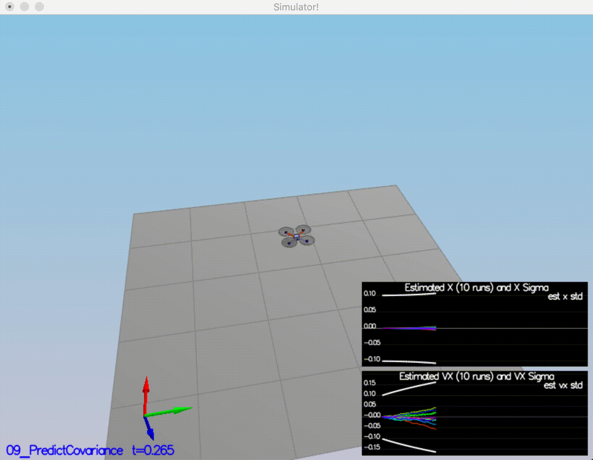

# Estimation Project #

In this project, I implemented the tasks described in [the estimation project](https://github.com/udacity/FCND-Estimation-CPP).   

## The Tasks ##

The list of tasks implemented in this project:

 - [Step 1: Sensor Noise](#step-1-sensor-noise)
 - [Step 2: Attitude Estimation](#step-2-attitude-estimation)
 - [Step 3: Prediction Step](#step-3-prediction-step)
 - [Step 4: Magnetometer Update](#step-4-magnetometer-update)
 - [Step 5: Closed Loop + GPS Update](#step-5-closed-loop--gps-update)
 - [Step 6: Adding Your Controller](#step-6-adding-your-controller)

### Step 1: Sensor Noise ###
*Task: Determine the standard deviation of the measurement noise of both GPS X data and Accelerometer X data.*

I ran the simulator `06_NoisySensors` scenario and recorded GPS X data and Accelerometer X data in `config/log` folder. Then I processed the log files to calculate the standard deviations by using Python's numpy library. You can see the calculation code in `calculate_std.py` script.
Std for GPS X and Accelerometer X data was found as follows
`gps_x_std:  0.7234761537348884`, `acc_x_std:  0.5096556221430085`   

As the next step I plugged in these values and ran `06_NoisySensors` scenario. My standard deviations should accurately capture the value of approximately 68% of the respective measurements. In addition, my answer matched the settings in `SimulatedSensors.txt`. You can see the results in following figure.

### Step 2: Attitude Estimation ###

*Task: Implement a better rate gyro attitude integration scheme in the UpdateFromIMU() function.*

I implemented this with `UpdateFromIMU()` function  in `QuadEstimatorEKF.cpp`.
The integration scheme uses quaternions to improve performance over the current simple integration scheme.

Successfully reduced the attitude errors to get within 0.1 rad for each of the Euler angles. The resulting flight can be seen in th efollowing figure.

### Step 3: Prediction Step ###
*Task: Implement all of the elements of the prediction step for the estimator.*

I implemented the prediction step in this task. I implemented the state prediction step in the `PredictState()` function in `QuadEstimatorEKF.cpp`. You can see the result in the following figure that the estimator state track the actual state, with only reasonably slow drift.

As the next step, I implemented calculation of the partial derivative of the body-to-global rotation matrix in the function `GetRbgPrime()`. Then I implemented the rest of the prediction step, predicting the state covariance forward in `Predict()` function in `QuadEstimatorEKF.cpp`. 

As the last step, I tuned  tune the `QPosXYStd` and the `QVelXYStd` process parameters in `QuadEstimatorEKF.txt` to try to capture the magnitude of the error. You can see the results in the following figure. Looking at this result, you can see that in the first part of the plot, our n  covariance (the white line) grows very much like the data.

### Step 4: Magnetometer Update ###

*Task: Implement the magnetometer update.*

I tuned the parameter `QYawStd` in `QuadEstimatorEKF.txt` for the QuadEstimatorEKF so that it approximately captures the magnitude of the drift. 
As the next step, I implemented magnetometer update in the function `UpdateFromMag()`to both have an estimated standard deviation that accurately captures the error and maintain an error of less than 0.1rad in heading for at least 10 seconds of the simulation. You can see the flight result in the following figure.
 

 
### Step 5: Closed Loop + GPS Update ###

*Task: Implement the GPS update.*

I tuned the process noise model in `QuadEstimatorEKF.txt` to capture the error with the estimated uncertainty (standard deviation) of the filter.
Then I implemented the EKF GPS Update in the function `UpdateFromGPS()`. After implementing `UpdateFromGPS()` function I re-ran the simulation.
You can see the simulation run in the following figure. It successfully completes the entire simulation cycle with estimated position error of < 1m.. 

### Step 6: Adding Your Controller ###

*Task: Up to this point, we have been working with a controller that has been relaxed to work with an estimated state instead of a real state.  So now, you will see how well your controller performs and de-tune your controller accordingly.*

I replaced `QuadController.cpp` with the controller I wrote in the last project along with `QuadControlParams.txt` with the control parameters you came up with in the last project. 
I reverted to ideal sensors and de-tuned under those conditions. The resulting flight completes the entire simulation cycle with an estimated position error of < 1m.  The result can be seen in the following figure.

